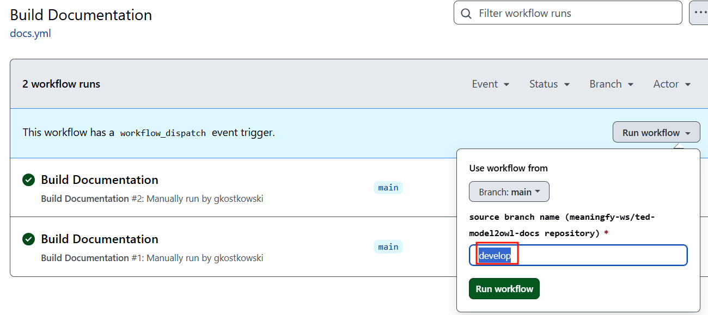

# model2owl-docs-gh-pages

This repository serves as a dev/staging environment for publishing model2owl documentation. A manually triggered workflow builds the documentation from source stored in [OP-TED/ted-model2owl-docs](https://github.com/OP-TED/ted-model2owl-docs) repository.
The published documentation is available at [https://meaningfy-ws.github.io/model2owl-docs-gh-pages](https://meaningfy-ws.github.io/model2owl-docs-gh-pages/public-review/index.html).

The repository contains Github actions workflow file, Antora configuration, and specific static assets needed for building the documentation from sources stored outside this repository. 

## Usage
1. Find a branch containing documentation sources ([a list of active branches](https://github.com/OP-TED/ted-model2owl-docs/branches/active))
2. Open a Github actions page for the [Build Documentation](https://github.com/meaningfy-ws/model2owl-docs-gh-pages/actions/workflows/docs.yml) workflow
3. Click on _Run workflow_ button, enter the name of the chosen branch and launch the workflow

4. Wait for the execution to complete
5. Vist [the website]([https://meaningfy-ws.github.io/model2owl-docs-gh-pages](https://meaningfy-ws.github.io/model2owl-docs-gh-pages/public-review/index.html)) with the newly deployed documentation

